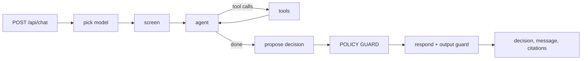
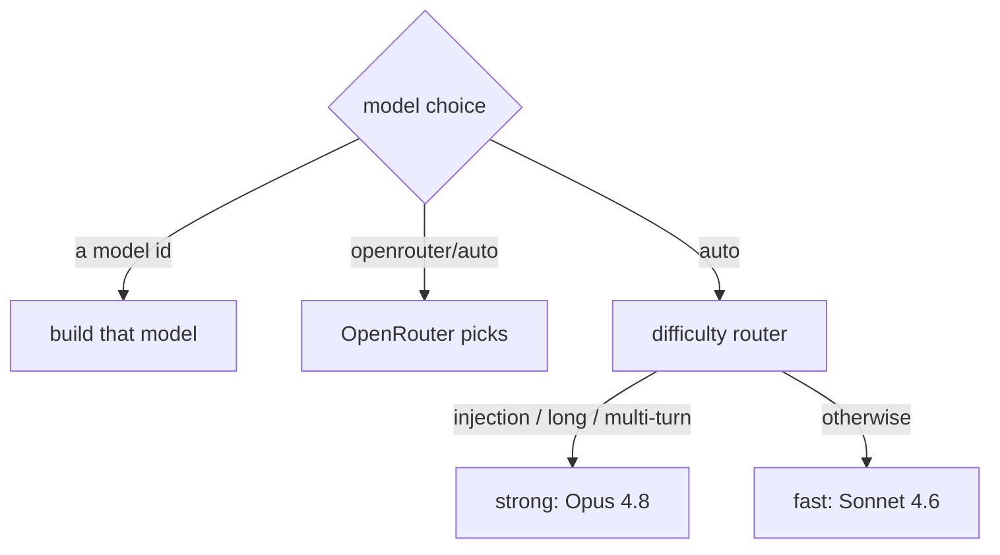
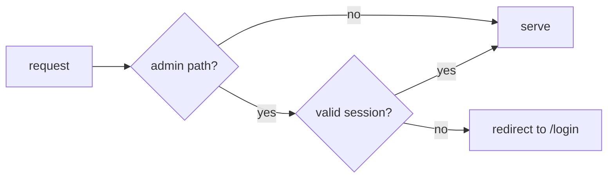

# Architecture

The app is three layers with hard directory boundaries. The boundary is the design: the UI never imports the agent, the API is the only caller of the orchestration layer, and the policy engine has no knowledge of the model or the framework.

```
UI            src/app (pages), src/components        chat + admin pages
API           src/app/api                            route handlers
Orchestration src/agent, src/policy                  LangGraph graph + policy engine
Data          src/db                                 SQLite wrapper, schema, trace store
```

## A single turn



`pick model` chooses from the admin selector or the AUTO router. `agent` and `tools` loop until the model stops requesting tools; `lookup_customer` returns the customer's orders on file, so the agent can identify the order a customer means without demanding an id. `propose` asks for a decision that matches a fixed schema, retrying on invalid output. `guard` re-runs the deterministic engine and overrides the model when they disagree. `respond` applies the output guardrail and returns the final, guard-approved message.

A decision is one of four states: `approve`, `deny`, `escalate`, or `needs_info`. The first three are refund outcomes the engine rules on; `needs_info` is a conversational turn: the agent is still gathering information (for example, which order the customer means) and grants nothing.

## The policy engine is the source of truth

`src/policy/engine.ts` is pure and deterministic. It takes an order, a customer, a request, and a clock, runs every rule, and resolves an outcome by precedence: a denial outranks an escalation, which outranks an approval. It does no I/O and calls no model, so it is fully unit tested on its own.

The rules (`src/policy/rules.ts`) each cite the policy clause they enforce:

- §2.1 final-sale items are never refundable (deny)
- §2.2 the order must be within the 30-day return window (deny)
- §2.3 the order must exist and belong to the customer (deny)
- §3.1 refunds over $500 require human escalation (escalate)
- §3.2 customers with three or more prior refunds are escalated (escalate)
- §3.3 the refund is capped at the amount paid (enforced as a cap, not a denial)

## The guard

The model proposes a decision and explains it. The guard (`policyGuard` in `src/agent/graph.ts`) re-runs the engine against the order actually resolved during the run and the customer id the request was made for, never the model's restatement of either. If the engine disagrees with the model, the engine wins and the response is rebuilt from the engine's verdict. The model cannot produce an approval the engine forbids, so pleading and prompt injection cannot move the outcome.

`needs_info` is handled by a deterministic gate of its own. Because a needs_info turn grants nothing, the guard passes it through with the amount forced to zero rather than consulting the engine, with one exception: when the input screen flagged a hard manipulation attempt (instruction override, role injection, prompt exfiltration, fake authority), the turn falls through to the engine and resolves to a refusal. An exfiltration attempt gets a denial, never a clarifying question.

## Models and routing

The model layer spans three providers and an AUTO router.

- `src/agent/models.ts` is the catalog: the selectable options and which providers have a key.
- `src/agent/model-factory.ts` builds a model for a turn. Provider is chosen by which key is present (Anthropic, then OpenAI, then OpenRouter); OpenRouter is reached through the OpenAI client pointed at its endpoint, so one key covers many models.
- `src/agent/router.ts` is the AUTO router. The deterministic guard enforces policy regardless of model, so AUTO is a cost-and-quality optimization, not a safety mechanism: it spends a stronger model only on requests that look harder or adversarial, and records the reason in the trace.



`AGENT_MODEL` overrides everything. The model selector lives only in the admin playground; `/api/chat` ignores any client-supplied model unless the request carries a valid admin session, so consumers always run AUTO. Cost is computed from each call's token usage against `src/obs/pricing.ts`, and the chosen model plus the routing reason are recorded as a trace event.

## Guardrails

Three layers, in order of strength:

1. **Input screen** (`src/agent/screen.ts`): cheap heuristics flag manipulation (instruction override, role injection, prompt exfiltration, fake authority). Non-blocking; it annotates the trace and feeds the router.
2. **Policy guard** (the deterministic engine): the real protection. The model cannot emit an approval the engine forbids, so policy violations are stopped structurally, not by prompt wording.
3. **Output guard** (`src/agent/guardrails.ts`): a final check that the reply does not echo the system prompt, replacing it with a safe message if it does.

This is deliberately not a general guardrails framework. For a narrow policy domain a deterministic engine is stronger and more auditable than a model-based guard that can itself be prompted around. A heavier framework (content moderation, PII redaction) would be added only if the surface widened beyond refunds.

## Admin and access

Two route groups:

- **Consumer** (`/`, `/chat`): the customer chat. AUTO model, no operator controls. The chat shows the acting customer's CRM card (account, prior refunds, orders) and streams the agent's reasoning steps live while a turn runs.
- **Admin** (`/admin/*`), six surfaces:
  - **Overview**: aggregate metrics: runs, the red-team pass rate, decision mix, latency, cost.
  - **Playground**: the chat plus the model selector and a scenario runner that replays the red-team cases (pre-canned from real runs, or live) turn-by-turn or auto-run.
  - **Traces**: every run's waterfall timeline: per-step latency, tool I/O, retries, the model routing reason, screen flags, and the guard's model-vs-engine verdict.
  - **Policy**: the written policy beside the latest red-team results.
  - **Records**: the live CRM store, editable in place (allowlisted fields, admin-gated mutations) with a reset back to the seed fixtures. An edit is visible to the agent on its next turn.
  - **Face-off**: one request run through every configured model in parallel, decisions and cost side by side.



`src/middleware.ts` gates every `/admin` path. Login posts the password to `/api/admin/login`, which compares it in constant time (`src/server/password.ts`) and sets a short-lived signed session cookie (`src/server/session.ts`: an HS256 JWT via jose, HttpOnly and Secure in production). The password lives in `ADMIN_PASSWORD`; for a multi-user system you would store a per-user salted hash instead.

## Observability

Every node and tool writes a trace event through `src/obs/trace.ts` into `agent_runs` and `agent_trace_events`. The admin dashboard reads exactly what the trace writes: the traces page renders the events as a waterfall (each step's duration scaled against the slowest), and the chat polls the same store through `/api/runs/live` to stream reasoning steps while a turn is in flight. There is one source of truth for both. When a LangSmith key is present, the same runs also stream to LangSmith. Logs are structured pino with a `module` field per subsystem.

## Failure handling

`src/faults` holds the error taxonomy (recoverable, validation, provider, policy-violation, fatal) and a fault-injection switch (`FAULT_INJECT`) that is off by default. Nodes are wrapped so failures are classified and recorded rather than swallowed: malformed structured output re-prompts, provider errors fail over to the next configured provider when one is available, and the customer always receives a safe message. Provider failure classification covers 429/5xx responses, rate-limit and overload error shapes, and billing exhaustion (Anthropic reports an exhausted balance as a 400; OpenAI as `insufficient_quota`). A provider that cannot serve any request fails over the same way a 500 does, and the full adversarial suite passes on the fallback provider alone. `db_locked` is injected at the CRM query boundary instead of the trace store so the failure remains visible in the run timeline.

## Data

`src/db/index.ts` exposes a small async query surface (`get`, `all`, `run`, `exec`) over SQLite and seeds the CRM tables from `seed/customers.json` on first run, so a fresh clone needs no migration step. The records explorer edits these same tables live through allowlisted, admin-gated mutations, and `reseedCrm` restores the seed fixtures without touching trace history. The same surface would back a networked database without changing any call site.
